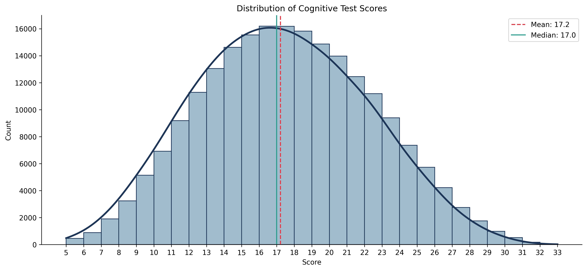
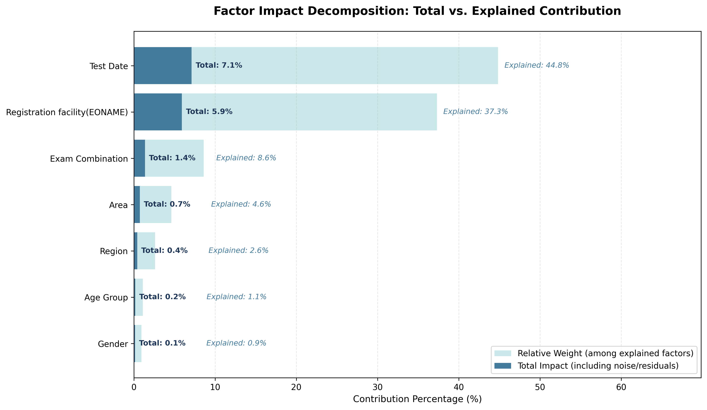
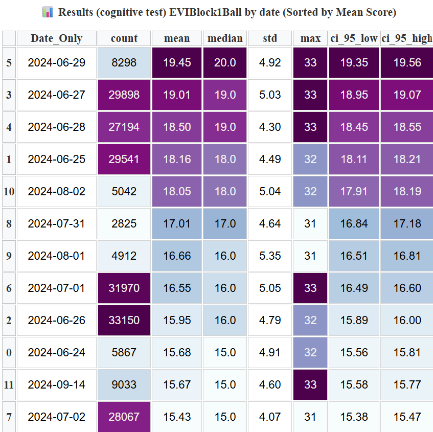
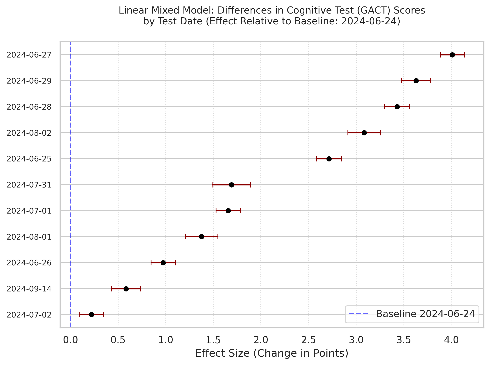
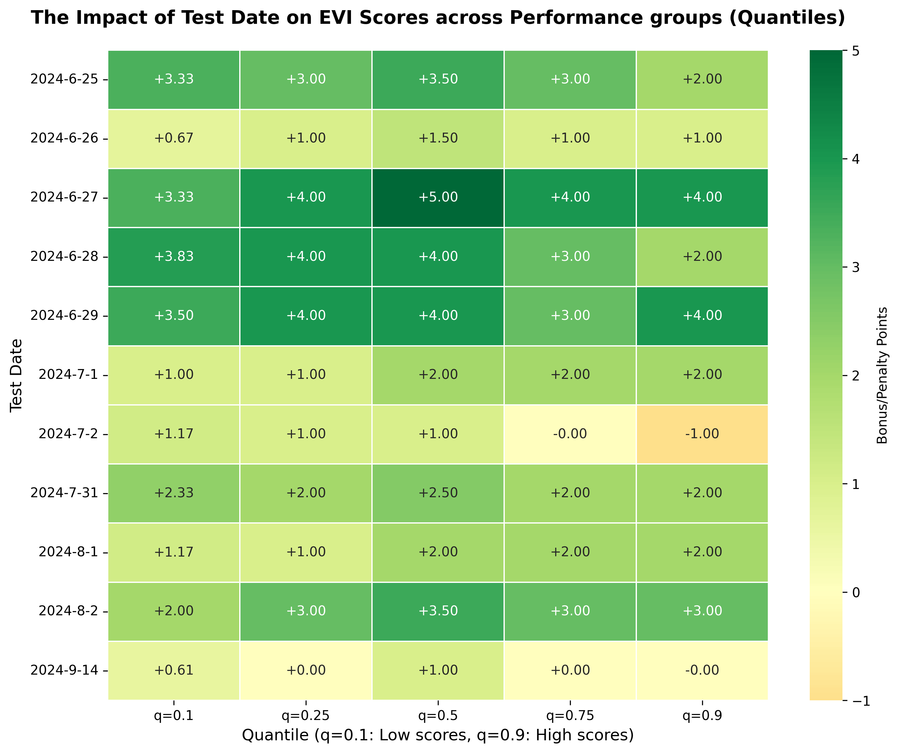
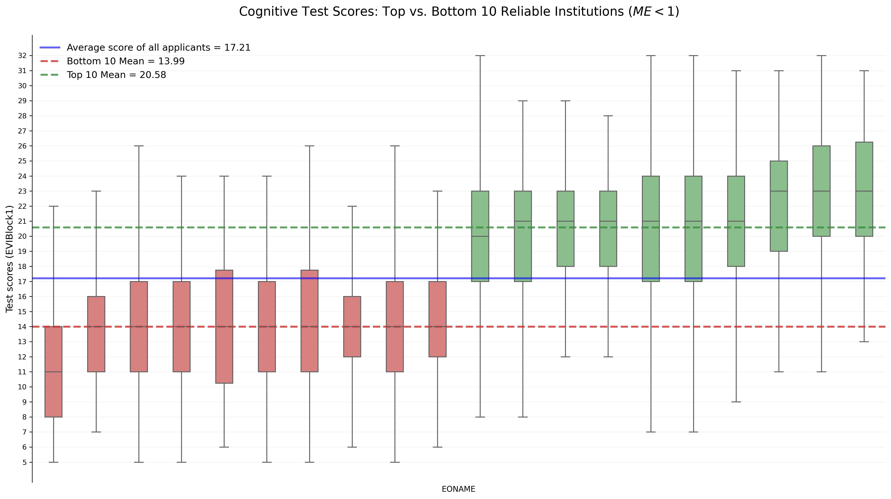
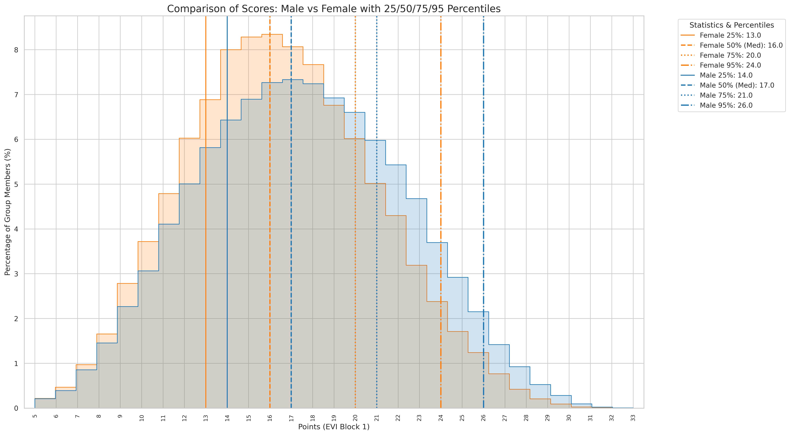
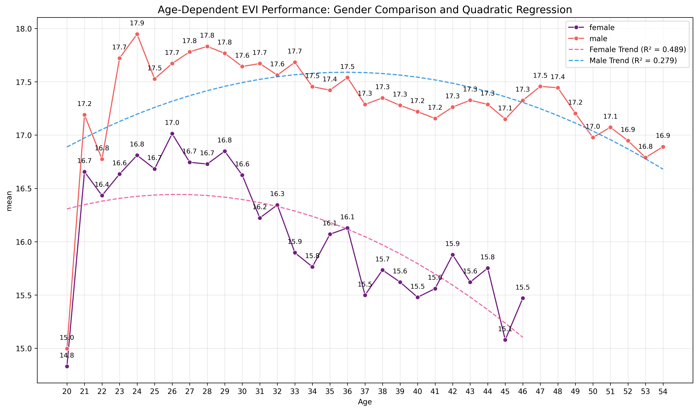
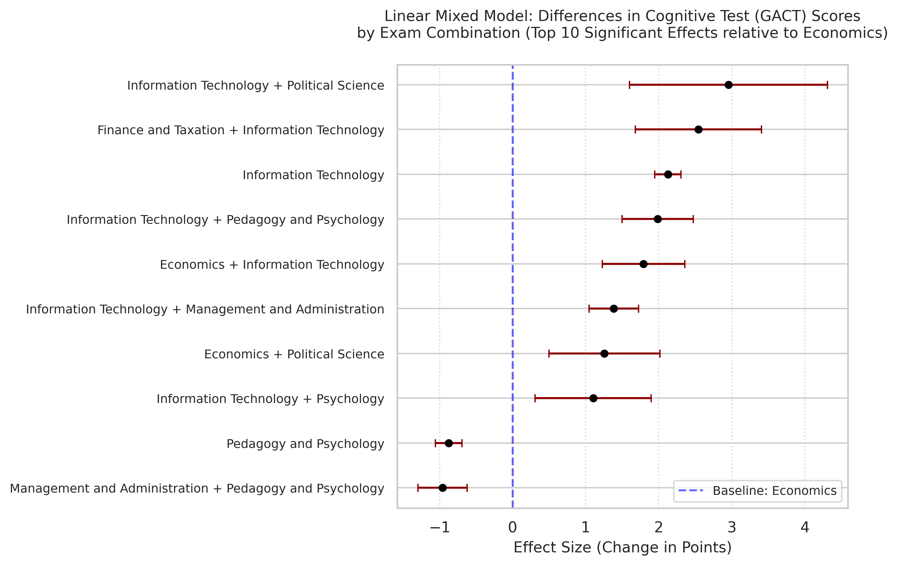
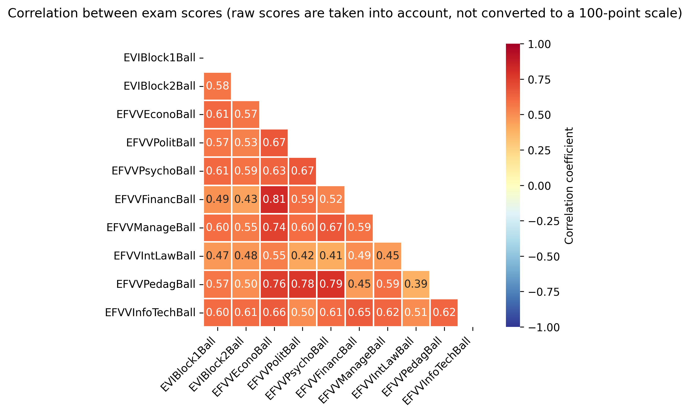

# Test Date Bias in Ukraine’s 2024 GACT: Multivariate Analysis of Cognitive Scores and Key Predictors

### 📂 Data Source 
Raw Data: https://drive.google.com/drive/folders/1LCkuTZIFSVHCslZbj5FEKNAy010Z0GWH

## 🎯 Key Findings
* The date when the test was taken has a big impact on the final score. The difference between the best day and the worst day is at least **3.88 points** (about **11.75%** of the maximum score of 33 points).
* Across various regression models and after controlling for demographic factors, the test date **explains at least 5.38% of the total variation in cognitive test scores**.
* On some days the test gave students up to **+4.01 extra points** compared to the baseline day (June 24, 2024).
* Certain versions of the tests (test dates) were better suited to “weaker” or “stronger candidates”, but more often were systematically harder or easier for everyone.
* Information technology as a professional exam is associated with higher scores on the cognitive test (up to 3 points in certain combinations).
 The registration institution accounts for 9.28% of the variance in cognitive test scores for applicants aged under 25, as well as 9.43% of the variance for all applicants in a simplified regression model.
* Gender has almost no practical effect on the average score (only 0.73%). However, men’s scores are more spread out and more men reach the very top results (this matches the **Greater Male Variability Hypothesis**)
* Age accounts for only 0.31% of the variation in a standard regression and only 0.45% even when segmented. The highest average score was at age 24 (17.8 points) — these applicants had usually just completed their master’s degree.
* Psychology was the easiest subject test (highest median score), while Finance was the hardest. Information Technology and Political Science best distinguished between strong and weak students.

## 📊 Visualizations 

*The visualization shows that GACT scores follow a nearly normal distribution.*
  

*The ANOVA Type II model was used, as it most effectively demonstrates the relative weight of each variable. Every factor is statistically significant (*p < 0.001*), confirming that the observed patterns are not due to random chance.* 
  

*The table shows significant differences in the results of test-takers who took the tests on different days, with no overlapping of the 95% confidence intervals. The significance of the differences across test days is further confirmed by the Games-Howell test.*
  
 
*The linear mixed model confirms that a test-taker in the same age group, of the same gender, and registered at the same institution ('EONAME') may gain or lose up to 4 points depending solely on the test date.*
  
 
*The quantile regression heat map confirms the conclusion that the effect of test date is systematic, rather than a bias toward “strong/weak” applicants (though with some variation).*
  

*While this graph highlights an extreme comparison between the top 10 and bottom 10 institutions, both Type II ANOVA and Welch’s one-way ANOVA confirm that over **9%** of the variance in scores is attributable to the registration entity ('EONAME').*
  

*While the effect of gender on individual outcomes is minimal (0.73% of total variance), the aggregated data show that the male distribution is shifted toward higher values. Furthermore, the lower kurtosis in the male group confirms **greater internal variation** compared to females.*
  

*The graph shows the change in the average cognitive test score by age for men and women; only values where the standard error is less than 0.3 points (less than 1% of all possible points) are included. A more quadratic trend is observed in the distribution of scores for women. This is interesting in that marginal factors influencing individual scores demonstrate clear patterns for aggregated scores.*
  
 
*The linear mixed model confirms that the chosen exam “Information Technology” (in various combinations) is associated with higher scores on cognitive tests. The presence of this subject in a group of applicants can increase the average score by up to 4 points, although the overall effect of the combination of exams on explaining cognitive test results is relatively low (3.2% according to one-way ANOVA).*
  
 
*Correlations between the various EPEE (EFVV) and UEE (EVI) subtests range from moderate to strong. Notably, the correlation between the cognitive block ('EVIBlock1Ball') and Information Technology ('EFVVInfoTechBall') is on par with or even lower than that of several other subjects.*
  

## 📋 Project Overview
The repository contains an analysis of the results of the cognitive test (General Academic Competency Test) for 2024. It examines the impact of various demographic and other available factors on the cognitive test results. It also analyzes the correlation between the results of other tests (in particular, professional exams) taken by applicants in 2024. 
The data is taken from the website of the Ukrainian Center for Educational Quality Assessment **https://testportal.gov.ua/zvity-dani-yeviyefvv-2024/**. 
The main objective is to assess the fairness of cognitive testing for all university applicants in Ukraine in 2024 by comparing different test dates and analysing their impact on results. In my opinion, the Test date must not significantly affect an applicant’s prospects of continuing their education.
To understand the differences in distribution between different tests and to assess how various factors influence the results of cognitive testing (GACT) such as: age, gender, the applicant’s institution of registration, the combination of selected exams, and region etc. Additionally, to evaluate information regarding the complexity and discriminatory power of professional tests.

# The entire analysis was conducted in **Google Colab** using Python.
## 👤 Author
- Yurii Zelinskyi, Ukraine
- Independent researcher, 2026  
- Part of my data analysis portfolio

# 🔬 Methodology
- Descriptive statistics and visualizations
- Welch’s ANOVA and Games-Howell post-hoc tests
- Multivariate regression with Type II ANOVA
- Linear Mixed Model (with random effect of registration institution)
- Quantile regression for heterogeneous effects
- Pearson correlation analysis between subject-specific exams

🔖 Reference
* **GACT / General Academic Competency Test / Cognitive test/ `EVIBlock1Ball`** — is a compulsory section of the Unified Entrance Examination (UEE) for admission to master’s and postgraduate programmes in Ukraine. It assesses logical and analytical thinking, as well as the ability to process information similar to an IQ test (*UA: ТЗНК / Тест загальної навчальної компетентності*).
* **Test date/ `EVITestDate`** — It is important to understand that, in the Ukrainian context, the **‘Test date’ is not simply a matter of the date, day of the week, etc., but rather refers, in most cases, to different versions of cognitive tests** containing different tasks. On certain test days, two sessions of the Unified Entrance Examination (including the cognitive test) are held, each with completely different tasks. The Ukrainian Centre for Educational Quality Assessment (UCEQA) does not provide detailed information about the specific test variants for each day.
* **Registration entity/ Registration facility / Registration institution/ `EONAME`** — is an institution of higher education where Ukrainian applicants register to take the Unified Entrance Exam (*UA: Єдиний вступний іспит (ЄВІ)*) and the Unified Professional Entrance Exams (*UA: Єдине фахове вступне випробування (ЄФВВ)*).**It is crucial to note that applicants may choose any institution to register for the exams**. Although applicants often choose the same institution where they previously earned their bachelor’s or master’s degree, this choice is entirely up to them.
* **EPEE / Professional exams** — is a form of entrance examination for admission to a master’s degree program that assesses the applicant’s level of preparation in their professional field (*UA: Єдине фахове вступне випробування (ЄФВВ)*).
* **Probable postgraduate** — this category includes applicants who have passed the cognitive test and the Unified Entrance Examination (including the foreign language component) but have not taken any other professional examination (Unified Professional Entrance Examination) or whose results have not been credited in the database.
* **Finance / Finance and Taxation / Accounting and Finance** — these are the terms used to refer to the professional examination in ‘Accounting and Finance’ (*UA: ‘Облік та фінанси’*). The raw scores for this exam are shown in the `EFVVFinancBall` column.
* **Pedagogy / Pedagogy and psychology** — these are the terms used to refer to the professional examination in Pedagogy and Psychology (*UA: ‘Педагогіка та психологія’*), to which the column with raw scores `EFVVPedagBall` corresponds; not to be confused with the other specialised examination, Psychology / Psychology and Sociology (*UA: ‘Психологія та Соціологія’*), for the raw scores of which the column `EFVVPsychoBall` corresponds.
* **Management / Management and Administration** — These are the terms used to refer to the unified professional examination and the ‘Management and Administration’ (*UA: ‘Менеджмент та Адміністрування’*) course. The raw scores for this exam are shown in the `EFVVManageBall` column.
* **Law / International Law** — These are the terms used to refer to the unified professional examination and the specialisation in Law and International Law (*UA: ‘Право’ and ‘Міжнародне право’*). The raw scores for this exam are shown in the `EFVVIntLawBall` column.
* **Foreign language / `EVIBlock2Ball`** — this is part of the compulsory Unified Entrance Examination (on a par with the GACT), which assesses the proficiency of applicants in a foreign language (English, French, etc.). The raw scores for this section of the UEE are shown in the EVIBlock2Ball column. **It is important to understand that this test is taken alongside the cognitive test, and applicants may allocate more time to one section or another**; in other words, the difficulty of one section of the test may influence how much time an applicant spends on another section.

## 📊 Results and Conclusions
→ [Read full conclusions here](report/results_and_conclusions.pdf)

